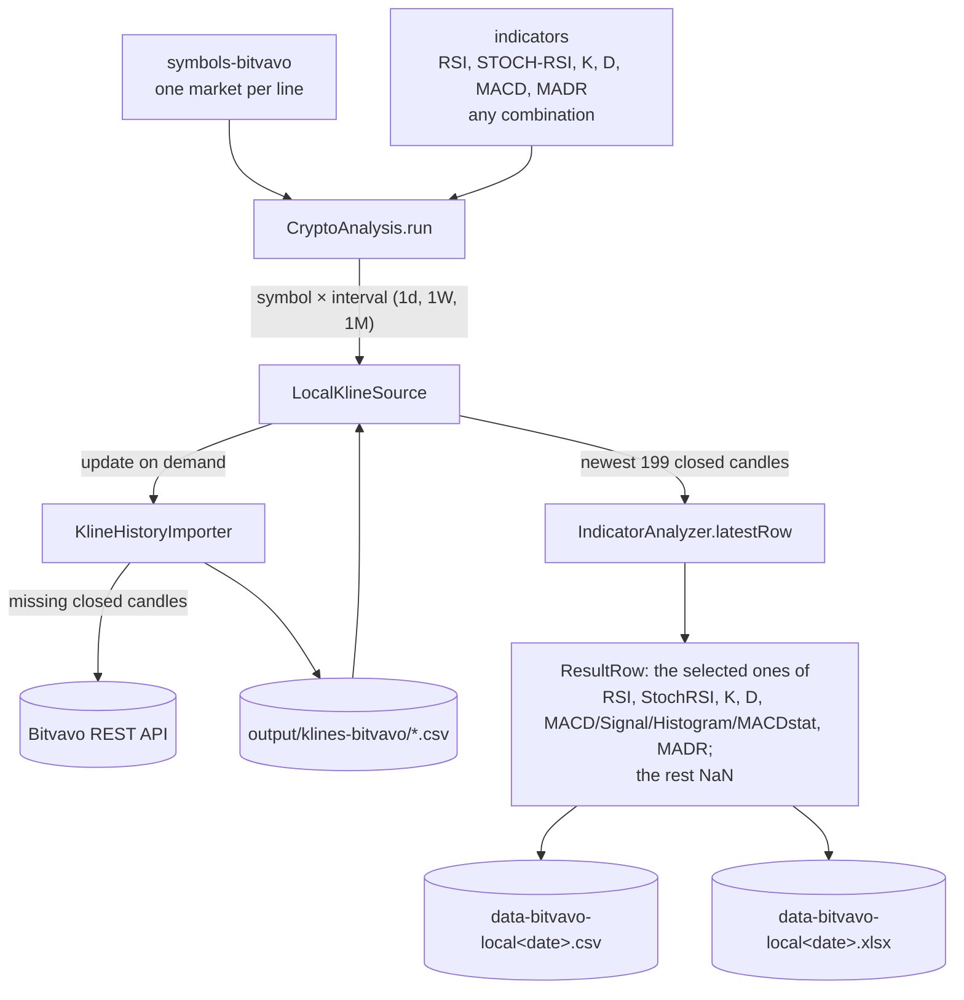
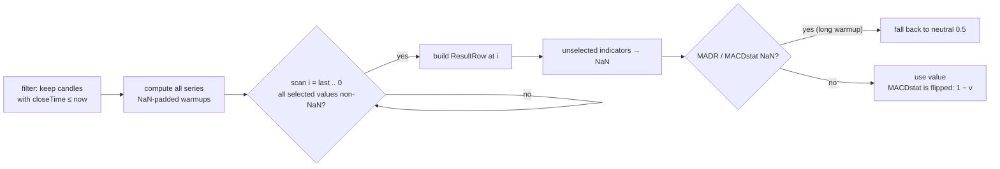

# CryptoAnalysisBitvavo — the analysis pipeline

`CryptoAnalysisBitvavo` is a thin entry point: it wires the exchange-independent
`CryptoAnalysis` pipeline to the **local candle store** (`output/klines-bitvavo/`)
through a self-updating `LocalKlineSource`, reads the **indicator selection**
from the `indicators` resource, and runs it for the intervals `1d`, `1W` and
`1M`.

The interesting work happens in three layers:

| Layer | Class | Job |
|---|---|---|
| Orchestration | `CryptoAnalysis` | fan out symbol × interval, gather rows, write CSV/XLSX |
| Extraction | `IndicatorAnalyzer` | compute all indicator series, pick the latest complete row |
| Math | `Indicators`, `SignalNormalizer` impls | the actual algorithms (see the other docs) |

## Data flow



## Choosing the indicators

The `indicators` resource (next to `symbols-bitvavo`) lists the indicators the
run reports on, one per line, `#` for comments — any combination of `RSI`,
`STOCH-RSI`, `K`, `D`, `MACD` and `MADR` (`MACD` covers the MACD line, signal
line, histogram and the normalized MACD stat). A file of the same
name next to the application overrides the resource, so a run can be
reconfigured without a rebuild. `Indicator.readSelection` parses it into an
`EnumSet<Indicator>`; an empty or misspelled selection stops the run at
startup.

The selection travels with the pipeline and every stage honours it:

| Stage | Left-out indicator |
|---|---|
| `IndicatorAnalyzer.latestRow` | not required to be complete; its value in the `ResultRow` is `NaN` (`ResultRow.has(indicator)` is false) |
| console line | not printed |
| CSV | column stays, cell is empty (reads back as `NaN`, so old and new files parse alike) |
| XLSX | value + range columns omitted, conditional formatting shifts along |
| `ResultRow.score()` | averages only the selected stats (RSI/100, StochRSI, K, D, MADR, MACD stat); nothing scorable selected → neutral 0.5 |

Every series is still computed — they are cheap, and K and D are built on the
Stochastic RSI anyway — only what goes into the row is filtered. That does
change which row is "the latest": a run on `RSI` alone accepts a young coin
with 20 daily candles, where the full selection needs the MACD warmup and would
drop it.

## Uncompleted candles are never used

The invariant is enforced in one place: `IndicatorAnalyzer.latestRow` keeps
only candles whose **close time has passed** (`closeTime ≤ now`) before any
indicator is computed. An uncompleted candle can therefore never leak into the
analysis, regardless of what the source returns:

```text
API run (open candle present):   [c c c c c ... c c O]   O = open candle,
                                                    └── closeTime > now ⇒ filtered
API run (no trades yet, open
candle omitted by Bitvavo):      [c c c c c ... c c c]   nothing filtered,
                                                          no closed candle lost
local run:                       [c c c c c ... c c c]   store holds closed
                                                          candles only
```

Because the filter checks time instead of position, the local store needs no
trickery: `LocalKlineSource` simply returns the newest `limit − 1` closed
candles — the same closed-candle window an API request for `limit` candles
yields once its open candle is filtered away.

The store itself upholds the same invariant on write: `KlineHistoryImporter`
only appends candles with `closeTime ≤ now`, so the still-open candle is never
written. It pages history **backwards** from now (Bitvavo's `limit` keeps the
newest candles of a range), deduplicates by open time in a `TreeMap`, and
skips the network entirely when the candle after the last saved one cannot
have closed yet.

## Concurrency

Every symbol × interval combination is an independent task on a **virtual
thread** (`Executors.newVirtualThreadPerTaskExecutor`). Results are collected
in a synchronized list in completion order; before the reports are written the
rows are sorted by **symbol** (alphabetically) and, within a symbol, by
**time-window length descending** (1M before 1W before 1d).

## Picking "the latest row"

`IndicatorAnalyzer.latestRow` computes all series over the closed candles and
walks **backwards from the newest candle** to the first index where every
**selected** indicator (out of RSI, StochRSI, K, D, MACD + signal) is non-NaN:



The two normalized statistics (MADR, MACDstat) need indicator warmup **plus** a
50-candle normalizer window, so on sparse series (e.g. monthly candles of a
young coin) they can still be NaN where everything else is complete. Rather
than dropping the row, they fall back to the neutral `0.5`.

## Parameters (constants in `CryptoAnalysis`)

| Constant | Value | Used by |
|---|---|---|
| `RSI_PERIOD` | 14 | [RSI](rsi.md) |
| `STOCH_RSI_PERIOD` | 14 | [Stochastic RSI](stochastic-rsi.md) |
| `K_PERIOD` / `D_PERIOD` | 3 / 3 | K and D smoothing |
| `MACD_FAST/SLOW/SIGNAL` | 12 / 26 / 9 | [MACD](macd.md) |
| `MADR_SMA_PERIOD` | 50 | [MADR](signal-normalization.md) |
| `NORMALIZER_WINDOW` | 50 | [Z-score normalizer](signal-normalization.md) |
| `KLINE_LIMIT` | 200 | candles fetched per series |

200 candles is deliberate headroom: the slowest chain (MADR = SMA 50 warmup +
z-score window 50 ≈ 99 candles; MACD stat similar) still leaves a comfortable
margin on a full series.

## Further reading

- [rsi.md](rsi.md) — Relative Strength Index with Wilder smoothing
- [stochastic-rsi.md](stochastic-rsi.md) — Stochastic RSI and the K/D lines
- [macd.md](macd.md) — EMA, MACD line, signal line, histogram
- [signal-normalization.md](signal-normalization.md) — MADR, scaled MACD
  histogram, and the three interchangeable normalizers
