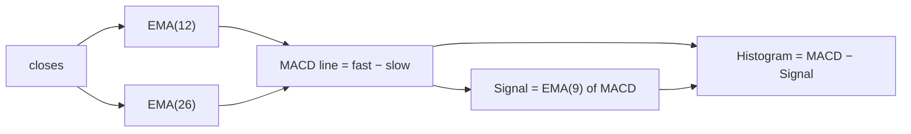

# MACD — Moving Average Convergence/Divergence (12 / 26 / 9)

Implemented in `Indicators.macdLine`, `Indicators.ema` and reported by the
pipeline as three numbers per row: **MACD**, **Signal** and **Histogram**.

## Idea

Two exponential moving averages of the close trail the price at different
speeds. Their *distance* is a momentum gauge: when the fast EMA pulls away
above the slow one, the recent trend is accelerating up; when it drops below,
down.

```text
price ╱╲    __
     ╱  ╲__╱  ╲___          fast EMA (12) hugs the price
    ╱   ····....  ╲___      slow EMA (26) lags behind
   ╱ ···        ···· ╲
  ╱··                ··╲
 MACD = fastEMA − slowEMA
```

## Building blocks

### EMA — exponential moving average

`Indicators.ema(values, period)`:

1. **Seed:** find the first run of `period` consecutive valid (non-NaN) values
   and start from their simple average. (The consecutive-run search matters
   because the signal line feeds the *NaN-padded* MACD series back into
   `ema`.)
2. **Recurse** with multiplier `α = 2 / (period + 1)`:

   ```text
   EMA_i = (value_i − EMA_(i−1)) × α + EMA_(i−1)
   ```

3. `NaN` inputs after the seed are *skipped*: the EMA holds its value and
   continues on the next valid input.

For period 12, `α ≈ 0.154`; for 26, `α ≈ 0.074` — hence "fast" and "slow".

### The three MACD series

```text
MACD line  = EMA₁₂(close) − EMA₂₆(close)
Signal     = EMA₉(MACD line)
Histogram  = MACD line − Signal
```



`macdLine` only emits a value where **both** EMAs are valid, so the MACD line
starts at the slow EMA's first index (25); the signal line needs 9 more MACD
values and starts at index 33.

## Reading the histogram

The histogram is "momentum of the momentum": it flips sign exactly where the
MACD line crosses its signal line.

```text
          MACD line ───            signal ┄┄┄
   ┼──────────╲─────────────╱──────────────
              ┄╲┄┄┄┄┄┄┄┄┄┄╱┄
                ╲_________╱
Histogram:
   ▲
   │ ▂▄▆█▆▄▂
 0 ┼──────────▁▂▄▆▄▂▁──────▂▄▆──▶
   │          ▔▔▔▔▔▔▔      (bars above 0: MACD above signal — bullish
   ▼                        bars below 0: MACD below signal — bearish)
```

- **Histogram > 0 and growing** — uptrend gaining strength
- **Histogram > 0 and shrinking** — uptrend stalling (cross may be coming)
- **Sign flip** — the MACD/signal crossover itself

## Units, and why the pipeline normalizes it

MACD is measured in **price units** (euros here). A histogram of `0.5` is huge
for a €0.20 coin and noise for BTC at €60 000 — the raw values are not
comparable across markets. The pipeline therefore also derives:

```text
scaledHistogram_i = (MACD_i − Signal_i) / close_i     (dimensionless)
```

which is normalized to the 0..1 `MACDstat` column and flipped so that 0 reads
"buy" and 1 reads "sell", consistent with the other statistics. That step is
described in [signal-normalization.md](signal-normalization.md).

## Warmup accounting (12/26/9)

| Series | first valid index |
|---|---|
| EMA(12) | 11 |
| EMA(26) | 25 |
| MACD line | 25 |
| Signal | 33 |
| Histogram | 33 |

Note that an EMA never converges completely: early values still carry the
seed's influence. With 200 candles fetched and ~166 candles of runway after
warmup, the values at the reported (latest) row are fully settled.
