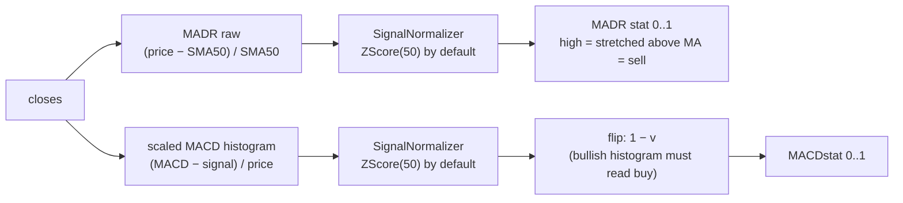

# MADR, MACDstat and the SignalNormalizer strategies

The report's last two statistics, **MADR** and **MACDstat**, share one recipe:

1. derive a *dimensionless* raw signal that oscillates around zero,
2. squash it into **0..1** with a pluggable `SignalNormalizer`,
3. orient it so that **0 reads "buy"** and **1 reads "sell"**.



## The two raw signals

### MA distance ratio (`Indicators.maDistanceRatio`)

```text
MADRraw_i = (price_i − SMA50_i) / SMA50_i
```

How far the price is stretched away from its own 50-candle average, as a
fraction of that average — a **mean-reversion** signal. `+0.08` means 8 %
above the average, independent of the coin's price level. `NaN` before the
first full SMA window and wherever the SMA is 0.

High = stretched above the mean = candidate **sell**, so its normalized value
is used as-is.

### Scaled MACD histogram (`Indicators.scaledMacdHistogram`)

```text
raw_i = (MACD_i − Signal_i) / price_i
```

The [MACD histogram](macd.md) divided by price, making it comparable across
coins. This is a **momentum** signal: positive = bullish. To keep the report's
"0 = buy, 1 = sell" orientation, `IndicatorAnalyzer` flips the normalized
value: `MACDstat = 1 − normalized`.

## The strategy interface

`SignalNormalizer` has three interchangeable implementations; `CryptoAnalysis`
uses `ZScoreNormalizer(50)` for both statistics, with a comment inviting you to
swap in the others to compare strategies. All follow the `Indicators`
conventions: same-size output, `NaN` wherever the input is NaN or the window
is not yet full / contains a NaN.

| | `ZScoreNormalizer` | `StochasticNormalizer` | `ClampNormalizer` |
|---|---|---|---|
| Window | rolling 50 | rolling 50 | none |
| Adapts to volatility | yes | yes | **no** |
| Can saturate at 0/1 | never | at every window extreme | outside the band |
| Flat window / zero range | 0.5 | 0.5 | n/a |
| Interpretation | "how unusual vs recent noise" | "position in recent range" | "absolute size vs fixed band" |

### ZScoreNormalizer — volatility-adaptive (the default)

For each index, compute mean and standard deviation of the raw signal over the
last 50 values, then:

```text
z        = value_i / σ_window          ← divides by σ only; the window mean
                                          is computed but not subtracted, so
                                          0 raw always maps to exactly 0.5
result_i = 1 / (1 + e^(−z))            ← logistic squash
```

The same +5 % MADR therefore reads *extreme* on a quiet coin (small σ ⇒ large
z) and *ordinary* on a volatile one. The logistic curve keeps the output soft
— it approaches but never reaches 0 or 1:

```text
 1.0 ┤                        ________
     │                   ____/
0.88 ┤· · · · · · · ·__/·   ← +2σ
0.73 ┤· · · · · ·__/·       ← +1σ
 0.5 ┤─ ─ ─ ─ ─╱─ ─ ─ ─ ─   ← raw value 0
0.27 ┤· ·__/· ·             ← −1σ
0.12 ┤__/                   ← −2σ
 0.0 ┤
     └───┬────┬────┬────┬───▶ z
        −2   −1    0   +1  +2
```

A zero σ (perfectly flat window) yields the neutral `0.5`.

### StochasticNormalizer — position in the recent range

Same min-max idea as the [Stochastic RSI](stochastic-rsi.md), applied to any
series:

```text
result_i = (value_i − min_window) / (max_window − min_window)
```

Always relative: the current value *is* today's window extreme ⇒ exactly 0 or
1, however small the move. Zero-width range ⇒ `0.5` (unlike `stochasticRsi`,
which returns `0.0` there).

### ClampNormalizer — fixed, interpretable band

```text
result_i = clamp((value_i + band) / (2 × band), 0, 1)
```

Maps `−band..+band` linearly onto 0..1 and clamps outside it:

```text
 1 ┤            ┌──────────
   │           ╱
0.5┤          ╱
   │         ╱
 0 ┤────────┘
   └────────┬───┬───┬──────▶ raw value
          −band 0 +band
```

Fully interpretable ("0.75 = half a band above zero") but blind to the
series' actual volatility, so the band must fit the signal: ~0.10 for an MA
distance ratio, an order of magnitude smaller (~0.02) for a price-scaled MACD
histogram.

## Warmup and the 0.5 fallback

The default chain is the longest one in the pipeline: MADR needs a 50-candle
SMA, and the z-score needs 50 valid *raw* values on top — roughly 99 candles
before the first MADR stat exists (similar for MACDstat via the MACD warmup).
On sparse series (e.g. `1M` candles of a young coin) the core indicators can
be complete where these two are still NaN. `IndicatorAnalyzer` then reports
the neutral **0.5** instead of dropping the row — "no opinion", not "no data".

## Reading the columns

```text
0.0 ──────────── 0.5 ──────────── 1.0
buy side       neutral       sell side

MADR     : price far below its MA50 ←→ far above it
MACDstat : strong bullish momentum ←→ strong bearish momentum (flipped)
```
