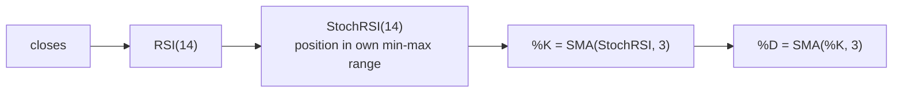

# Stochastic RSI, %K and %D (14 / 3 / 3)

Implemented in `Indicators.stochasticRsi(rsi, period)` plus two
`Indicators.sma` passes. It is an *indicator of an indicator*: the input is
the [RSI series](rsi.md), not the price.

## Idea

RSI itself can hover between 40 and 60 for months; classic 70/30 thresholds
then never fire. Stochastic RSI fixes that by asking a relative question:

> Where does the **current RSI** sit inside its **own range of the last 14
> candles**?

The answer is always 0..1, regardless of how compressed the RSI range is:

```text
RSI window (last 14 values)

 highest ─▶ 63 ┬────────────────────────  StochRSI = 1.0
               │
   current ─▶ 58 ─ ─ ─ ─ ─ ─ ─ ─ ─ ─ ─   StochRSI = (58−41)/(63−41) ≈ 0.77
               │
  lowest ─▶ 41 ┴────────────────────────  StochRSI = 0.0
```

## Algorithm

For every index `i` from `period − 1` on:

```text
lowest  = min(RSI[i−13 .. i])
highest = max(RSI[i−13 .. i])

StochRSI_i = (RSI_i − lowest) / (highest − lowest)
```

Rules taken straight from the implementation:

- Any `NaN` inside the window (RSI warmup) ⇒ the output stays `NaN`. The first
  StochRSI value therefore lands at index `rsiPeriod + stochRsiPeriod − 1`
  (index 27 with 14/14).
- A **zero-width range** (all 14 RSI values identical) yields `0.0` — note
  this differs from the normalizers in
  [signal-normalization.md](signal-normalization.md), which use `0.5` there.

## K and D — double smoothing

Raw StochRSI is jumpy: one new RSI extreme rescales the whole window. The
pipeline therefore reports two smoothed lines, each a 3-candle **simple moving
average**:



- **%K** — the "fast" line: SMA(3) of StochRSI
- **%D** — the "slow" line: SMA(3) of %K, i.e. doubly smoothed

The classic reading: %K crossing **above** %D near 0 hints at a turn up,
crossing **below** %D near 1 hints at a turn down.

```text
1.0 ┤      K ___
    │     ╱╲╱   ╲     K crosses under D near the top
0.8 ┤  D ╱       ╲╳ ─ ─ ─ (bearish cross)
    │   ╱         ╲╲
0.5 ┤ ╱            ╲╲___
    │╱               ╲  ╲
0.2 ┤          ╳ ─ ─ ─╲─╱─ (bullish cross near the bottom)
    │                  ╲╱
0.0 ┤
    └──────────────────────────────▶ time
```

## Warmup accounting

Each stage adds to the NaN prefix. With the pipeline's 14/14/3/3 parameters:

| Series | first valid index |
|---|---|
| RSI(14) | 14 |
| StochRSI(14) | 27 |
| %K = SMA(3) | 29 |
| %D = SMA(3) | 31 |

So a series needs at least 32 closed candles before `IndicatorAnalyzer` can
emit a row at all (MACD needs more history to be *stable*, but its 12/26/9
chain is valid from index 33 — see [macd.md](macd.md)).

## The NaN-aware SMA

`Indicators.sma` is a rolling-sum SMA with one extra rule: the output at `i`
is only set when **all** `period` window values are valid; any `NaN` in the
window keeps the output `NaN`. That keeps warmup gaps from leaking averaged
garbage into K and D.
